# Design review

Everything currently built and waiting on Kyle's approval. Nothing here is deployed.

Each pair is **before** (what's live today) then **after** (what's built). Mobile shots first, since that's probably how you're reading this.

---

## What changed, in one paragraph

One typeface everywhere (DM Sans, self-hosted), headings dropped from weight 700/800 to **500** with 110% line-height, and the accent rationed. That weight change is the single biggest lever: nothing was gained by shouting. Teal stays as the accent. The neutrals, boxes, buttons, shadows and spacing follow the Databricks system, which is where the premium feel actually comes from.

---

## Website hero

The whole argument for the change. Bricolage Grotesque at 800 and -0.03em becomes DM Sans at 500 and 110%, sized up 60 to 68px to buy back the presence weight was faking.

**Before**

**After**

Desktop

**Before**

**After**

---

## Client portal — home

Drops Lexend. Settings labels needed moving **up** to 600, because at 500 they dissolved into body text. The one place weight legitimately increases.

**Before**

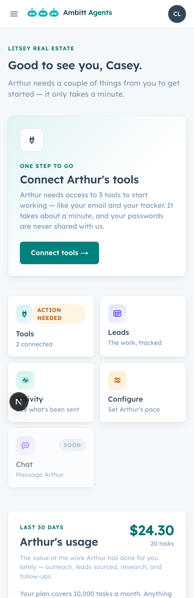

**After**

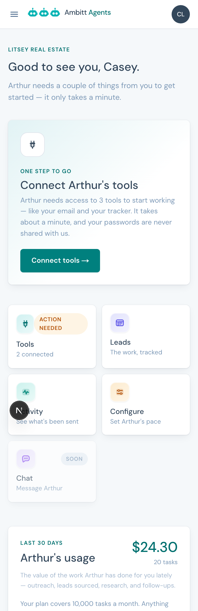

Desktop

**Before**

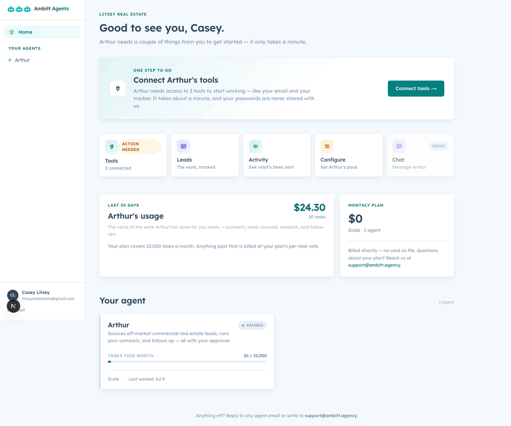

**After**

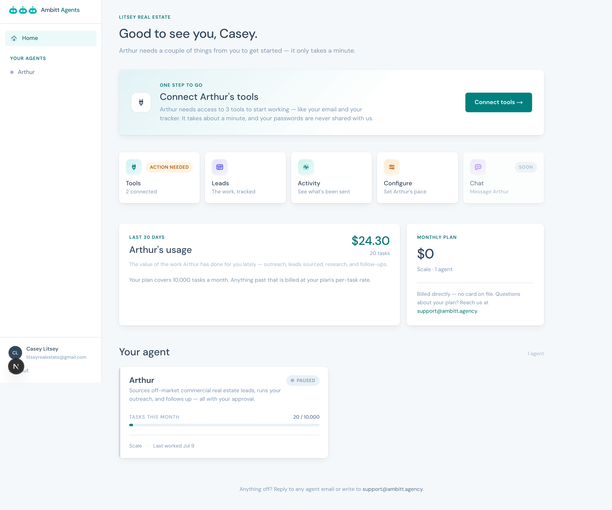

---

## Client portal — agent page

**Before**

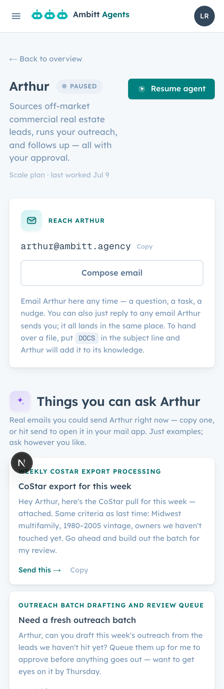

**After**

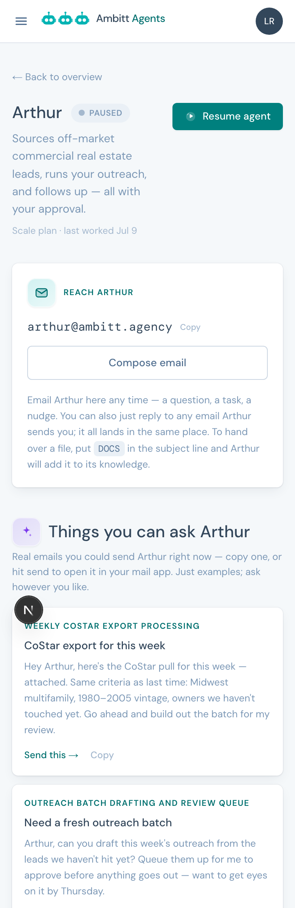

---

## Admin dashboard — agents

Your cockpit. KPI numerals went to 600 with tabular figures, because numbers have no ascenders or descenders to give them shape at 500.

**Before**

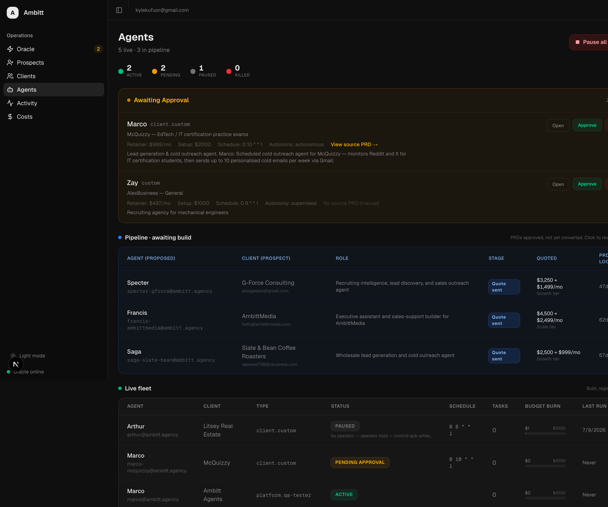

**After**

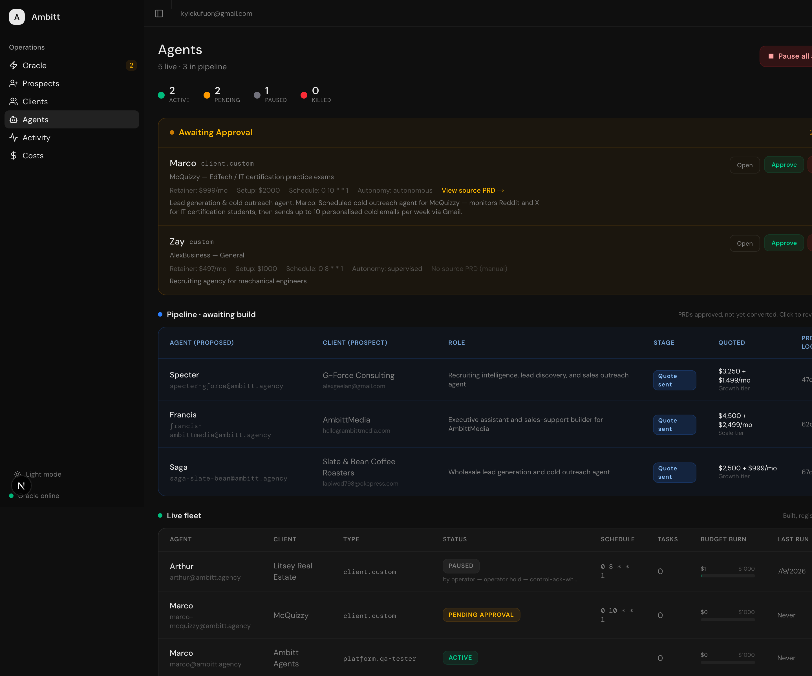

---

## Admin dashboard — clients

**Before**

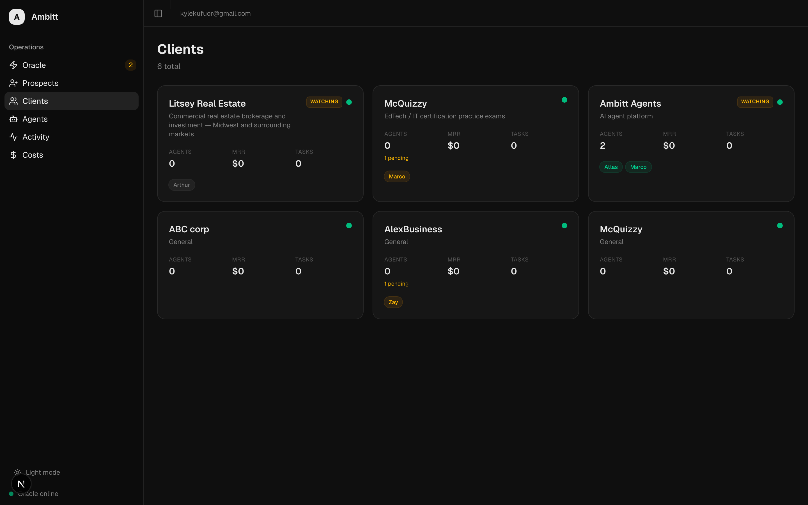

**After**

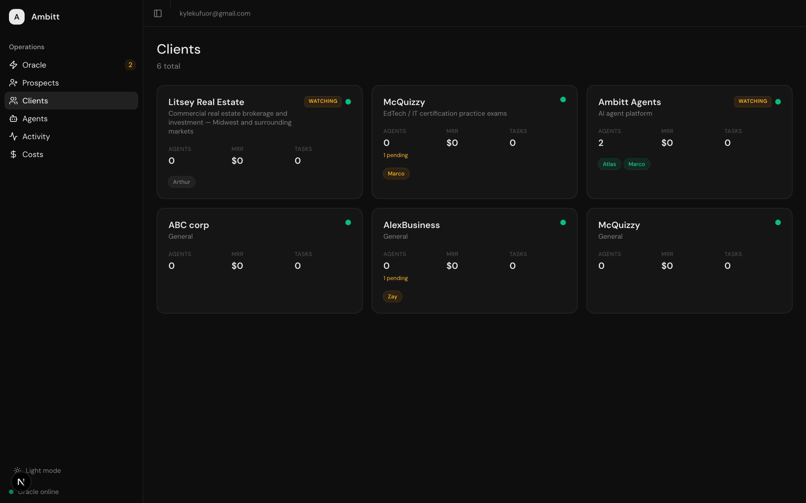

---

## Prospect intake form

Step 0 of the funnel. This one was also loading Inter from Google's CDN on every page view, which leaked the prospect's IP and blocked render on a third-party request. Now self-hosted.

**Before**

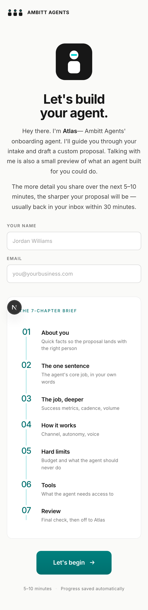

**After**

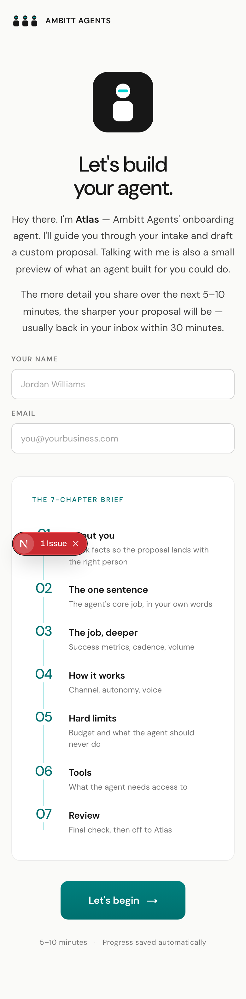

---

## Open question: the hero accent

The Databricks rule is one accent word per headline. Our hero colours the whole second line, because it's a call-and-response — the client's question in ink, the agent's answer in teal. Arguably the colour is carrying meaning rather than decorating.

Both versions are built. This is the variant with the stricter treatment:

---

## Also built, not shown here

These are HTML rather than screenshots, so they need a laptop:

- **All 12 agent emails**, rebuilt on one system — `docs/email-review/compare.html`
- **The pre-sale funnel** (proposal, quote, three teaser emails, portal status pages) — `docs/email-review/funnel.html`

Headlines from those two: the agent emails were running four competing design systems and the welcome email was the worst of them, which is also a client's first impression. On the funnel side, a webfont was declared but never loaded, so no prospect has ever seen the typeface we thought we were sending, and the teal button was failing accessibility at 2.59:1.

---

## Not deployed

| Change | Commit |
|---|---|
| Agent emails, all 12 rebuilt | `1bc4200`, `8e08700` |
| Portal teal, two-step scale | `53ac107` |
| Pre-sale funnel, one system | `19f3fbf` |
| DM Sans everywhere | `8fd6fd7` |

Databricks neutrals and component styles are still building, as is the intake form redesign.
